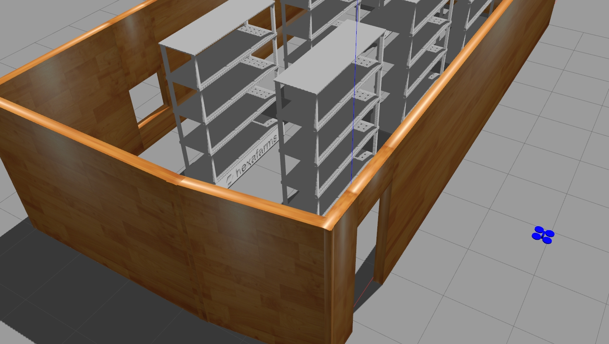

# `tello_ros_drone`

This repo is built on top of `tello_ros` \
For the installation of `tello_ros`, check the [original repo](https://github.com/clydemcqueen/tello_ros).

## Packages

There are 4 ROS packages:
* `tello_driver` is a C++ ROS node that connects to the drone
* `tello_msgs` is a set of ROS messages
* `tello_description` contains robot description (URDF) files
* `tello_gazebo` can be used to simulate a Tello drone in [Gazebo](http://gazebosim.org/),
* `tello_action` can be used to control a Tello drone based on distance.  **Contribution of this Repo**
* `tello_interfaces` support messages based on distance.  **Contribution of this Repo**

## My Contiribution
`tello_ros` is devloped with tello SDK 1.3 \
Therefore, distance based control is not possible. \
I have developed distance based service call.

### Manual cmd
`ros2 service call /tello_action tello_msgs/TelloAction "{cmd: 'takeoff'}"` \
`ros2 service call /drone1/move_cmd tello_interfaces/srv/HexaCmd "{dir: x, dist: 5}"` \
`ros2 service call /tello_action tello_msgs/TelloAction "{cmd: 'land'}"` \
dir should be among x, y, z, xy. (xy means z axis rotation), the unit of dist is m or radian.

### Replicate the hexafarms' simulation (video below)
`source {tello_ros_ws}/install/setup.bash`
`ros2 launch tello_gazebo simple_launch.py`
`./demo/hexa_drone_rc.bash`

